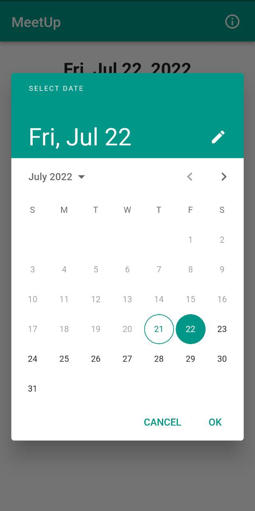

# meetup

A Flutter app to seemlessly schedule GMeet (google-meetings) and share the invite link or calendar event (ICS File)

## Screenshots of the app

1. Home screen:-  
  

2. Date Picker:-  
  

3. Scheduled meeting details:-  
  
